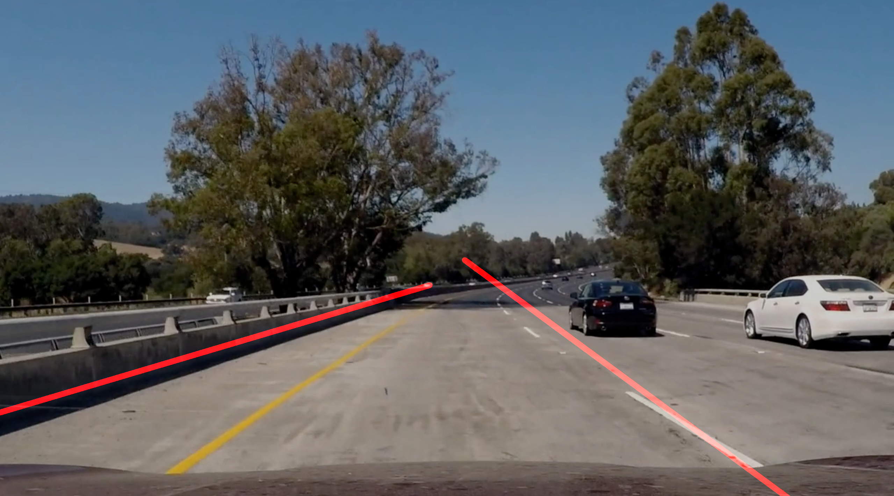

# **Finding Lane Lines on the Road** 

## Overview
When we drive, we use our eyes to decide where to go.  The lines on the road that show us where the lanes are act as our constant reference for where to steer the vehicle.  Naturally, one of the first things we would like to do in developing a self-driving car is to automatically detect lane lines using an algorithm.

## Goal

The goals / steps of this project are the following:
> * Make a pipeline that finds lane lines on the road
> * Reflect on your work in a written report

## Setup

1. install conda - I create a short [tutorial](https://medium.com/@mozesr/macos-deep-learning-environment-setup-e7831c9b7a35) for this
2. install aditional modules:
 -  moviepy: `conda install -c conda-forge moviepy`
 -  pillow: `conda install pillow`
 -  opencv2: `conda install -c menpo opencv`
 -  run jupyer: `jupyter notebook --ip='*' --port=8888 --no-browser --allow-root`

## Reflection

### 1. Pipeline

My pipeline consisted of  those steps:
> - convert to grayscale
> - blur filter
> - canny edge filter
> - mask for the region of interest
> - detect and draw the lane lines with Hough transform
> - Merge the Lane lines image with the original one

The first 3 steps **grayscale+blur+canny**  are to identify the dominant objects outlines (the blur effect takes care to eliminate "noise" which is picture details in our case). 

We mask the **region of interest** to the half bottom of the image. This is an issue for a production pipeline because we assume heavily on the position and angle of our Point-of-view in relation to the car.  

In order to draw a **single line on the left and right lanes**, I modified the `draw_lines()` function:
> - Split all the lines by its X-values (before the middle of the screen - to the left and visa versa). 
> - Remove lines that are too horizontal (less than 30 degrees). 
> - Estimate the linear coefficients of each side with my `calc_line_fit` function. We use a weight-array to increase the effect of **long lines** we detect in the hough transform. The longer the line - the better the computer can "see" it - and this is why it should influence our decision more. 
> - Low-pass-filtering the coefficients results with a previous lanes state we keep globally in order to prevent rapid changes by the different "edge cases" we may encounter during our ride - this keeps a slow transition of the car along the lanes and makes the pipeline more robust. 
>  - for example: our previous left lane was (a0,b0) = (-50, 30) our LPF coefficient is a=0.95 and we just calculated the left lane is (a1,b1)=(-40, 20) so our new lane is going to be: (a,b) = a*(a0,b0) + (1-a)*(a1,b1) = 0.95*(-50,30) + 0.05*(-40,20) = (-49.5, 29.5).
> - With the linear coefficients we can **draw two lines** (left and right). 

### 2. Eye candy
Here are several images with my lane detection pipeline applied. 

#### solid white lane

#### solid yellow lane

#### bumpy road

### 3. Identify potential shortcomings with your current pipeline

The potential shortcomings would be what would happen when:
> - change lanes 
> - rapid lane change (steep curl)
> - night environment
> - foggy environment
> - other car too close (we won't see all the lanes details)

Because my Lane-line LPF filter to prevent rapid changes in the lane rendering, when we will have a road the needs us to change fast - we will not be able to do so. 

### 4. Possible improvements to this pipeline

Obviously we can improve on this lane detection approach with color-detection, for example. Probably more methods are out there. 

I think that human don't detect lanes like this pipeline - we don't only use the actual lane outline to figure out the lane boundaries. I would also use the "neighbor lane" detection and "road" detection to enhance the results for "my lane" detection. 
