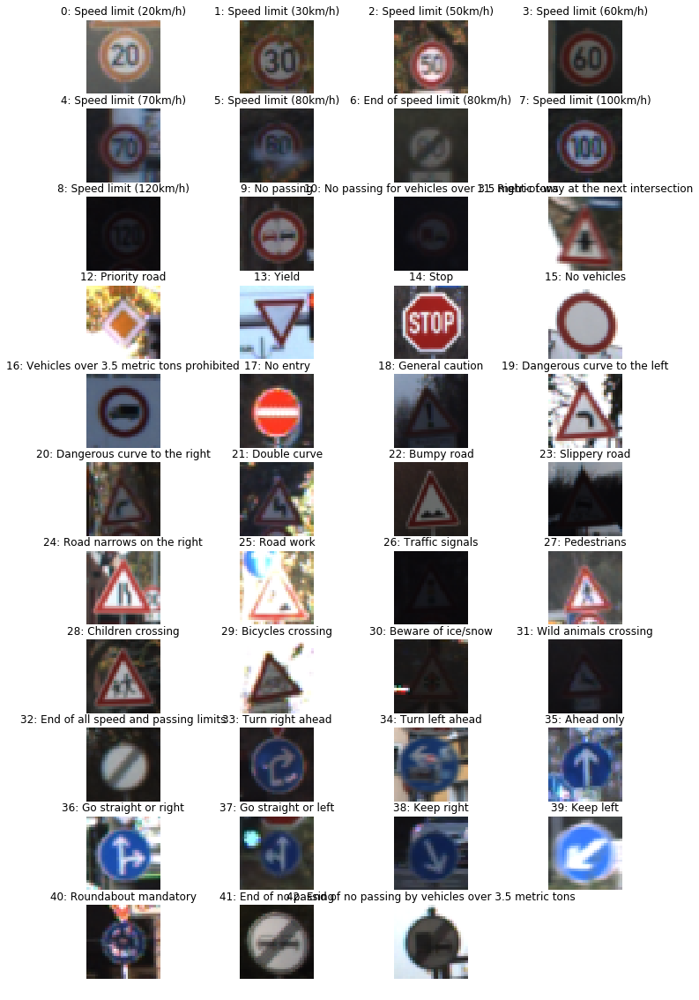
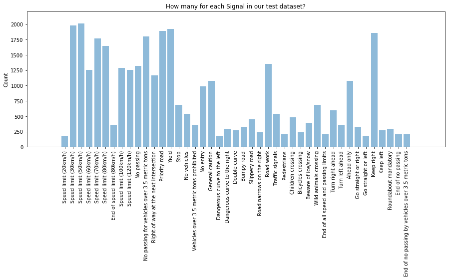
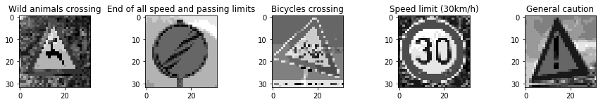

# Traffic Sign Recognition

Moshe Roth's solution of Project #2 of Udacity's Self Driving Car Nanodegree.
---

**Build a Traffic Sign Recognition Project**

## Goals/Steps
* Load the data set (see below for links to the project data set)
* Explore, summarize and visualize the data set
* Design, train and test a model architecture
* Use the model to make predictions on new images
* Analyze the softmax probabilities of the new images
* Summarize the results with a written report

## Source
You're reading it! and here is a link to my [project code](./Traffic_Sign_Classifier.ipynb)

## Rubric Points
Here I will consider the [rubric points](https://review.udacity.com/#!/rubrics/481/view) individually and describe how I addressed each point in my implementation.  

##Dependencies

use *Python 3.5* and the following  libraries:

- [Jupyter](http://jupyter.org/)
- [NumPy](http://www.numpy.org/)
- [SciPy](https://www.scipy.org/)
- [scikit-learn](http://scikit-learn.org/)
- [TensorFlow](http://tensorflow.org)
- [OpenCV](http://opencv.org/)

##Data Set Summary & Exploration
I used the pandas library to calculate summary statistics of the traffic
signs data set:

* Download dataset: [traffic-signs-data.zip](https://d17h27t6h515a5.cloudfront.net/topher/2017/February/5898cd6f_traffic-signs-data/traffic-signs-data.zip)
* The size of training set is 34799
* The size of validation set is 4410
* The size of test set is 12630
* The shape of a traffic sign image is (32, 32, 3)
* The number of unique classes/labels in the data set is 43

## Exploratory visualization of the dataset

The dataset is a bunch of images from 43 different classes of traffic signs in germany.

The bar chart shows the data distribution of the training data. Each bar represents one class of the dataset.

##Design and Test a Model Architecture

### Preprocessing stage

As a first step, I decided to convert the images to grayscale because this is 
a small dataset so I wanted to reduce the number of features to learn from. Plus, 
training the model was significantly faster with grayscale.  
As a last step, I normalized the image data to a scale of 0..1 which increased the results by several 
precents. 

I decided to generate additional data because Deep networks need large amount of 
training data to achieve good performance. To build a powerful image classifier 
using very little training data, image augmentation is usually required to boost t
he performance of deep networks. 

To add more data to the the data set, I used the random rotation and zoom to 
scale the images. 

- Originally we had 34799 images
- Added 34799 new images
- Now we have 69598 images

#### Model Architecture
 
 I used Lenet neuronal network to classify the traffic signs. 
 The input of the network is an image and the output is 
 the probabilty of each of the possible traffic signs.
 
 My final model consisted of the following layers:

| Layer         		|     Description	        					|
|:---------------------:|:---------------------------------------------:|
| Input         		| 32x32x1 grayscale image   							|
| Convolution 5x5     	| 2x2 stride, valid padding, outputs 28x28x6 	|
| RELU					|												|
| Max pooling	      	| 2x2 stride,  outputs 14x14x6 				|
| Convolution 5x5	    | 2x2 stride, valid padding, outputs 10x10x16    |
| RELU					|												|
| Max pooling	      	| 2x2 stride,  outputs 5x5x16 				|
| Flatten				| 3 dimensions -> 1 dimension					|
| Fully connected		| input 412, output 122        									|
| RELU					|												|
| Dropout				| 50% keep        									|
| Fully connected		| input 122, output 84        									|
| RELU					|												|
| Dropout				| 50% keep        									|
| Fully connected		| input 84, output 43        									|

#### Training

I trained the model on an AWS machine.

Here are my final training parameters:
- EPOCHS = 20
- BATCH_SIZE = 32
- LEARNING RATE = 0.0005)

My results after training the model:
* Validation Accuracy = **96%**
* Test Accuracy = **93.7%**

#### Approach

I used the Lenet neural network from the classroom and I changed it to use input of
32x32x1 instead of 32x32x3 and the last layer to categorize to 43 classes.
Adding more layers didn't not add much but augmenting and cleaning the data did create
a big difference.

###Test a Model on New Images

####1. Choose five German traffic signs found on the web and provide them in the report. For each image, discuss what quality or qualities might be difficult to classify.

Here are five German traffic signs that I found on the web:

The first image might be difficult to classify because it looks like other 
signs from afar. you need to get closer in order to really see the details.
The second sign of 'End of all limits' is very distinctive and should be ok
because it has a clear background. The 3rd one 'Bicycles' its rotated and 
I think it's not a good picture due to the big angle. The 4th and 5th are
very clear (sunlight with solid backgroud) so there is no problm with them.

####2. Discuss the model's predictions on these new traffic signs and compare the results to predicting on the test set. At a minimum, discuss what the predictions were, the accuracy on these new predictions, and compare the accuracy to the accuracy on the test set (OPTIONAL: Discuss the results in more detail as described in the "Stand Out Suggestions" part of the rubric).

Here are the results of the prediction:

| Image			        |     Prediction	        					| 
|:---------------------:|:---------------------------------------------:| 
| Wild animals crossing	| Dangerous curve to the left   									| 
| End of all speed and passing limits     			| End of all speed and passing limits 										|
| Bicycles crossing					| Children crossing											|
| Speed limit (30km/h)	      		| Speed limit (30km/h)					 				|
| General caution			| General caution      							|

The model was able to correctly guess 3 of the 5 traffic signs, which gives an accuracy of 60%. 

####3. Describe how certain the model is when predicting on each of the five new images by looking at the softmax probabilities for each prediction. Provide the top 5 softmax probabilities for each image along with the sign type of each probability. (OPTIONAL: as described in the "Stand Out Suggestions" part of the rubric, visualizations can also be provided such as bar charts)

The code for making predictions on my final model is located in the 11th cell of the Ipython notebook.

##### imgage 1

For the first image, (wild animal crossing )the model is relatively sure that this 
is a Dangerous curve (probability of 0.9). Those signs are very similar. But it's wierd
that the acutla category of Wild animal is low probabiliy after all.

| Probability         	|     Prediction	        					| 
|:---------------------:|:---------------------------------------------:| 
| .9        			| Dangerous curve to the left								| 
| .05     				| Slippery road 										|
| .0					| Double curve										|
| .0	      			| Wild animals					 				|
| .0				    | Bicycles      							|

##### imgage 2

For the second image, (End of all limits )the model is  sure that this 
is a End of limits!

| Probability         	|     Prediction	        					| 
|:---------------------:|:---------------------------------------------:| 
| .98       			| End of all limits								| 
| .02     				| End of no passing 										|

 ##### imgage 3
 
 For the third image, (Bicycles) the lost its features due to the resize. We see
 that the model is indecisive.  

| Probability         	|     Prediction	        					| 
|:---------------------:|:---------------------------------------------:| 
| .54        			| Roundabout								| 
| .12    				| Right of way the next...										|
| .08					| Speed limit										|
| .04	      			| Priority road					 				|
| .02				    | Speed limit      							|

##### imgage 4
 
 The forth image (30Km/Hr Speed limit) is predicted perfectly.  

| Probability         	|     Prediction	        					| 
|:---------------------:|:---------------------------------------------:| 
| 1.0        			| Speed limit 30								| 

##### imgage 5
 
 The fifth image, (General caution) is predicted perfectly. 

| Probability         	|     Prediction	        					| 
|:---------------------:|:---------------------------------------------:| 
| 1.0         			| General Caution							| 

 
