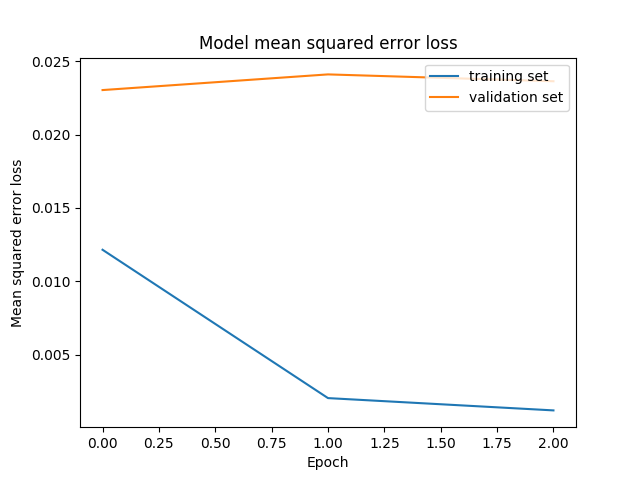

#**Behavioral Cloning** 


---

**Behavioral Cloning Project**

The goals / steps of this project are the following:
* Use the simulator to collect data of good driving behavior
* Build, a convolution neural network in Keras that predicts steering angles from images
* Train and validate the model with a training and validation set
* Test that the model successfully drives around track one without leaving the road
* Summarize the results with a written report
---
###Files Submitted & Code Quality

####1. Submission includes all required files and can be used to run the simulator in autonomous mode

My project includes the following files:
* helpers.py containing helpers functions for model.py
* model.py containing the script to create and train the model
* drive.py for driving the car in autonomous mode
* model.h5 containing a trained convolution neural network 
* README.md  summarizing the results

####2. Submission includes functional code

** Setup **
1. create conda environment 
`conda create -n moshe python=3.5`
2. install all pip requirements with `pip install -r requirements.txt`
3. install graphviz (`⚡ ⇒ brew install graphviz`)


To train the model with data from the simulator in the data folder do
```sh
python model.py
```

Using the Udacity provided simulator and my drive.py file, 
the car can be driven autonomously around the track by executing 
```sh
python drive.py model.h5
```


#####**Training with several driving-sessions**

After the first few attempts to train the driving model,
I understaood that it's all about the data, because with
low volume of driving training data the car kept shifting
off the track.


In order to load several driving-sessions generated by the simulator
I create a process that looks for sub-directories in a `data` directory - 
if this directory contains driving_log_compiled.csv I know it has data we 
need to train on. We gather all those images and targets we need to train for and 
put all of them in the training session. I let several people create simulation
data for me :) it was very useful!


####3. Submission code is usable and readable

##### model.py
The model.py file contains the code for training and saving the convolution neural network. 
The file shows the pipeline I used for training and validating the model, and it contains 
comments to explain how the code works. 
I used helpers.py to make model.py more understanable, it contains the following functions:
- preprocess_pipeline:
    Go over the data directory
    look for subdirectories that have a 'driving_log.csv' file inside
    each one is a data folder
    load the image names and the measurements
    out of each data create a log for the 'left', 'right' and 'center'
    images
- get_batches:
    Generator function to yield batches for the training
- build_classifier_nvidia:
    build the keras model
    
model.py basically doing 3 things:
1. preprocessing the data
2. training the data
3. saving the model to model.h5

##### drive.py
this script loads model.h5 (saved by model.py) and serves a prediction information with
flask-socketio framework to the unity car simulator. 


###Model Architecture and Training Strategy

####1. An appropriate model architecture has been employed

I used nvidia autonomous car network that attempted to train a similiar network
with the same goals - steering the car through a road. 


I used different hyperparameters, and I needed to output only one target - the steering angle
of the car. You can see the visualization later in the writeup. 

####2. Attempts to reduce overfitting in the model

The model contains a Lambda Layer to normalize the image data.  

The model was trained with several driving sesions from different people. 
I created a preprocessing pipeline to join all the data from the different 
drivers. I wanted to make sure that my (awful) driving style will not be
inherited by the model and it will be able to generalize with different people
driving the simulator.

I also drove against the track natural course of driving (like was suggested in the lesson). 
The model was tested by running it through the simulator and ensuring that the 
vehicle could stay on the track.

After I applied batch normalization and dropout I got worse results for some reason.
The car missed turns on the track. So I had to get even more data.
I drove the tracks (clockwise and counterclockwise) and also the 
difficult track again. After this the results looked better. 

####3. Model parameter tuning

The model used an adam optimizer, so the learning rate was 
not tuned manually.

####4. Appropriate training data

Training data was chosen to keep the vehicle driving on the road. 
I used a combination of center lane driving, recovering from the left 
and right sides of the road and added 0.18 angle correction for each 
image on the right/left to add more training data. 

During training, the batching generation is adding the flipped images as well
(with flipped angles of the steering wheel). 

I drove against the natural course of driving track to add more training 
data. And, as i said before I asked several people to drive the simulator 
in order for the model to generalize according to different sources of data. 

For details about how I created the training data, see the next section. 

Overall, I collected 57,312 items for training. 

###Model Architecture and Training Strategy

####1. Solution Design Approach

The overall strategy for deriving a model architecture was to gather
lots of training data which consists of:
* image - what does the driver see from the driver seat
* target - streeing angle

My first step was to use a convolution neural network model similar to the LeNet
network we use for Traffic sign recognition. I got lots of data, but the turns did
not end well as I expected. 
Than, I moved to the nvidia neural net and got the results much better. 


In order to gauge how well the model was working, I split my image and steering 
angle data into a training and validation set. I found that my first model had a 
low mean squared error on the training set but a high mean squared error on 
the validation set. 

I added several Batch-normalization layers and dropout to make the model
more robust (than it was able to drive the "difficult" track as well). 

The final step was to run the simulator to see how well the car was driving around 
track one. 

At the end of the process, the vehicle is able to drive autonomously around 
the track without leaving the road.

####2. Final Model Architecture

The final model architecture (model.py lines 18-24) consisted of a convolution neural 
network with the following layers and layer sizes:


```
_________________________________________________________________
Layer (type)                 Output Shape              Param #   
=================================================================
cropping2d_1 (Cropping2D)    (None, 90, 320, 3)        0         
_________________________________________________________________
lambda_1 (Lambda)            (None, 90, 320, 3)        0         
_________________________________________________________________
conv2d_1 (Conv2D)            (None, 43, 158, 24)       1824      
_________________________________________________________________
batch_normalization_1 (Batch (None, 43, 158, 24)       96        
_________________________________________________________________
leaky_re_lu_1 (LeakyReLU)    (None, 43, 158, 24)       0         
_________________________________________________________________
conv2d_2 (Conv2D)            (None, 20, 77, 36)        21636     
_________________________________________________________________
batch_normalization_2 (Batch (None, 20, 77, 36)        144       
_________________________________________________________________
leaky_re_lu_2 (LeakyReLU)    (None, 20, 77, 36)        0         
_________________________________________________________________
conv2d_3 (Conv2D)            (None, 8, 37, 48)         43248     
_________________________________________________________________
batch_normalization_3 (Batch (None, 8, 37, 48)         192       
_________________________________________________________________
leaky_re_lu_3 (LeakyReLU)    (None, 8, 37, 48)         0         
_________________________________________________________________
conv2d_4 (Conv2D)            (None, 6, 35, 64)         27712     
_________________________________________________________________
batch_normalization_4 (Batch (None, 6, 35, 64)         256       
_________________________________________________________________
leaky_re_lu_4 (LeakyReLU)    (None, 6, 35, 64)         0         
_________________________________________________________________
conv2d_5 (Conv2D)            (None, 4, 33, 64)         36928     
_________________________________________________________________
batch_normalization_5 (Batch (None, 4, 33, 64)         256       
_________________________________________________________________
leaky_re_lu_5 (LeakyReLU)    (None, 4, 33, 64)         0         
_________________________________________________________________
flatten_1 (Flatten)          (None, 8448)              0         
_________________________________________________________________
dense_1 (Dense)              (None, 100)               844900    
_________________________________________________________________
batch_normalization_6 (Batch (None, 100)               400       
_________________________________________________________________
dense_2 (Dense)              (None, 50)                5050      
_________________________________________________________________
batch_normalization_7 (Batch (None, 50)                200       
_________________________________________________________________
dense_3 (Dense)              (None, 10)                510       
_________________________________________________________________
batch_normalization_8 (Batch (None, 10)                40        
_________________________________________________________________
dense_4 (Dense)              (None, 1)                 11        
=================================================================
Total params: 983,403
Trainable params: 982,611
Non-trainable params: 792
_________________________________________________________________

```

Here is a visualization of the architecture 


####3. Creation of the Training Set & Training Process

I used Udacity's car simulator to collect images from the driver's seat. Every item in the
data consists of 3 images - from the center POV and from the left and right (which I used
with a streeting angle correction to get even more data for my training) and the streeting
angle. The simulator collects more targets like the acceleration volume etc but in this 
project I was required to ignore it - just predict the streeing angle of the car on 
every point the car drives on the track. 

I cropped every image so only the relevant view is visible (without the sky/trees/etc and without
the driver wheel at the bottom of the image). It looks like this:
original image:

cropped image:


I finally randomly shuffled the data set and put 15% of the data into a validation set. 

I used this training data for training the model. The validation 
set helped determine if the model was over or under fitting. The ideal 
number of epochs was 5. I used an adam optimizer so 
that manually training the learning rate wasn't necessary.
The training history looks like this



# Video
check out the video of the car driving autonomously the entire track :) `run.mp4`