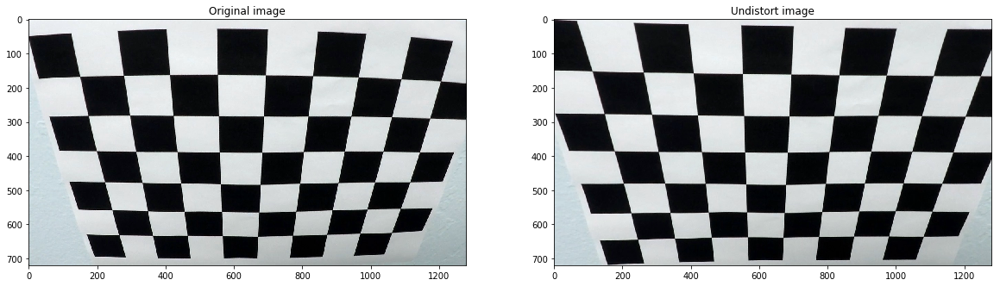

# Project #4 - Advanced Lane Finding Project

The goals / steps of this project are the following:

* Compute the camera calibration matrix and distortion coefficients given a set of chessboard images.
* Apply a distortion correction to raw images.
* Use color transforms, gradients, etc., to create a thresholded binary image.
* Apply a perspective transform to rectify binary image ("birds-eye view").
* Detect lane pixels and fit to find the lane boundary.
* Determine the curvature of the lane and vehicle position with respect to center.
* Warp the detected lane boundaries back onto the original image.
* Output visual display of the lane boundaries and numerical estimation of lane curvature and vehicle position.

# Camera Calibration
## Compute the camera calibration matrix and distortion coefficients given a set of chessboard images

In this part we don't know the effect that the camera have for the image it takes so we must calibrate it.
We need to calculate the coefficients for a linear transition to fix the distortion.  If an image from the camera is scaled by a factor, all of these parameters should be scaled (multiplied/divided, respectively) by the same factor. We can have several kinds of distortion, one of them is radial 
 

There are more kinds of distortion, and opencv calibrate all the linear ones.
step1: read the calibration images that came with the core project, we have 20 different
 images from different angles for us to use in the calibration process.
 
  
 
step 2 is to prepare the "object points", which will be 3d coordinates of the chessboard corners.
```
In the new interface it is a vector of vectors of calibration pattern points in the calibration pattern coordinate space (e.g. std::vector<std::vector<cv::Vec3f>>). The outer vector contains as many elements as the number of the pattern views. If the same calibration pattern is shown in each view and it is fully visible, all the vectors will be the same. Although, it is possible to use partially occluded patterns, or even different patterns in different views.
```
taken from opencv documentation.
It took me some time to understand exactly the purpose of the object points. Opencv calculates the  "image points":
```
it is a vector of vectors of the projections of calibration pattern points
```


Each of the images is going through the calcaultations and te projections are added to one array that we use for the final calibration matrix calculation (with `cv2.calibrateCamera()` function)for the linear transformations.  
In the next stage, we apply the distorion correction to each image frame before starting the vision processing of the road.



We can see clearly, due to radial distortion, straight lines will appear curved. What we need in order to undistort any image now are: **mtx** and **dist**.
### Provide an example of a distortion-corrected image.
Finally, we try the distrotion correction we calculated earlier on the road test images that we were given, one the left
you can find the original image and on the right you can see the undistorted image:


you can see the undistortion effect by the change in shape of the car hood

# Pipeline 

The pipeline is defined in the `pipeline` function and it receives as an input an image (numpy) and returns the processed images after the following steps:
1. undistort (with calibration chessboard correction)
2. thresholding
3. perspective trainsition (bird-view)
4. cut only the region of interest
5. detect the lines with window-fit approach
6. calculate the polynomical coefficients that represents the lines of the road
7. draw a new numpy matrix that represents the result frame and return it

## (Advanced) Binary Thresholding methods
### Describe how (and identify where in your code) you used color transforms, gradients or other methods to create a thresholded binary image. Provide an example of a binary image result.

A method or combination of methods (i.e., color transforms, gradients) has been used to create a binary image containing likely lane pixels. There is no "ground truth" here, just visual verification that the pixels identified as part of the lane lines are, in fact, part of the lines. Example binary images should be included in the writeup (or saved to a folder) and submitted with the project.

Pipeline contains combination of color and gradient thresholds to generate a binary image (thresholding steps at cell #5 through #7.

1. Apply Sobel on x-axis and y-axis


2. Apply Magnitude and Gradient Sobel thresholds

3. Apply Direction of Gradient Sobel thresholds

4. Threshold color channel (S channel from HLS color space) - like was suggested in the lesson

5. Combine all thresholds


All those operations occure in the following functions: `threshold, color_channel_threshold, combine_sobel_thresholds, dir_threshold, mag_thresh, abs_sobel_thresh` 

## Perspective transform
### Describe how (and identify where in your code) you performed a perspective transform and provide an example of a transformed image.

OpenCV function or other method has been used to correctly rectify each image to a "birds-eye view". Transformed images should be included in the writeup (or saved to a folder) and submitted with the project.

In the function `convert_perspective` we do two things:
1. we do the **perspecitve transform** for the image to create a bird-view perspective using the chosen vertices.

The transformation is moving the following source points to the destination points in the target view:

| Source        | Destination   | 
|:-------------:|:-------------:| 
| 180, 720      | 320, 720      | 
| 575, 460      | 320, 0        |
| 705, 460      | 960, 0        |
| 1150, 720     | 960, 720      |

This happens in the `perspective_trainsfrom` function called by `convert_perspective`.
This funtion is also used when we want to draw the result back for the lane coloring in the end of the pipeline. This is
why I added the `inv` argument so we can call it for both the perspective convert and the inverse operation
as well.


2. mask the **region of interest** - after the bird-view convert we have lots of information in the image
that we really don't need to use. We are going to mask it with thw `get_region_of_interest` method.

The result in the end of this step looks like this:


You can see that the "noise" at the edges of the image disappears after the masking.

## Detect the Lane line pixels
### Describe how (and identify where in your code) you identified lane-line pixels and fit their positions with a polynomial

Methods have been used to identify lane line pixels in the rectified binary image. The left and right line have been identified and fit with a curved functional form (e.g., spine or polynomial). Example images with line pixels identified and a fit overplotted should be included in the writeup (or saved to a folder) and submitted with the project.

We do the line detection in a function called `detect_lines`.
 
1. We are taking a histogram of the left and right line and where we see peaks we know its a 
lane so we can start from that point. 

2. Now we are setting the width of the windows to 100 and the minimum number of pixels found to recenter window to 50

3. If we dont detect lines - step through the windows one by one.

4. Extract left and right line pixel positions and Fit a second order polynomial to each


## Calculate the radius of curvature of the lane and the position of the vehicle with respect to center.
### Describe how (and identify where in your code) you calculated the radius of curvature of the lane and the position of the vehicle with respect to center.

In the function `rad_and_offset` we are calculating 
the radius and curvrate in relation to the center 
of the lane. We are fitting the lanes with a polynomial fit.


## Final result
### Provide an example image of your result plotted back down onto the road such that the lane area is identified clearly.


# Video

[link to my video result](./project_video_processed.mp4)

# Discussion
## Briefly discuss any problems / issues you faced in your implementation of this project. Where will your pipeline likely fail? What could you do to make it more robust?

Because we using the `Line` class to detect small changes in the road shape, when the road changes rapidly 
this method won't work. I actually used the same method on the 1st project and also understrood there that the lane can't
change to fast because my algorithm won't change as quickly as the road, this also happens here.

We can improve the algorithm by using other elemnts in the picture to help us understand the lane orientation
and shape (like landscape and other elements in the side of the road and other cars maybe)

We can improve the algorithm by changing dynamically the thresholds and differetn constants in corrolation to many other parameters like 
 steep road, light conditions, other objects in the road etc.

