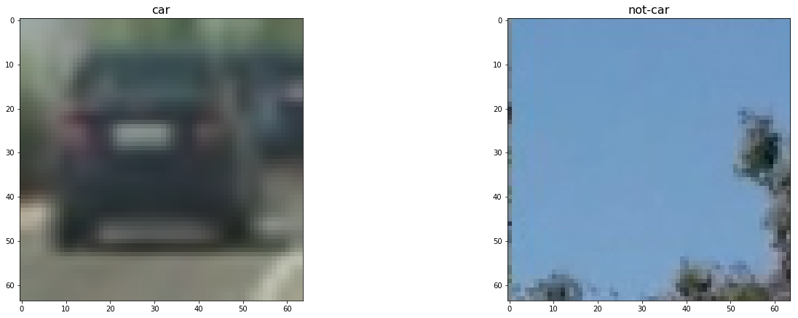
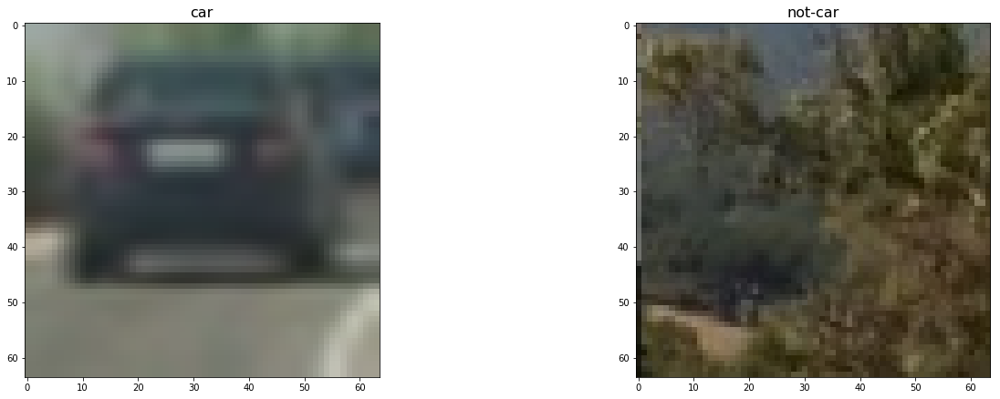
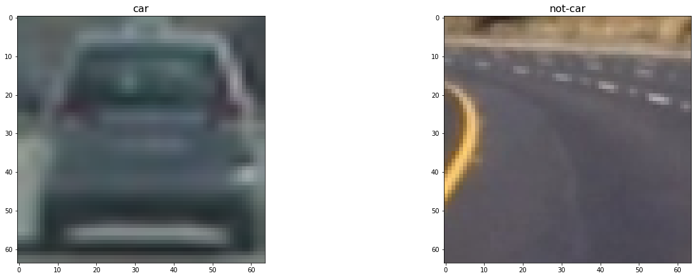
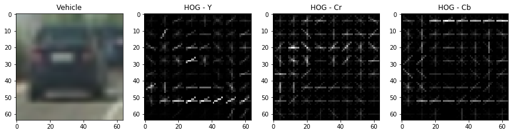
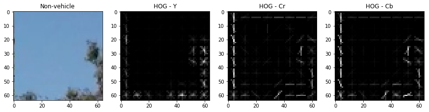
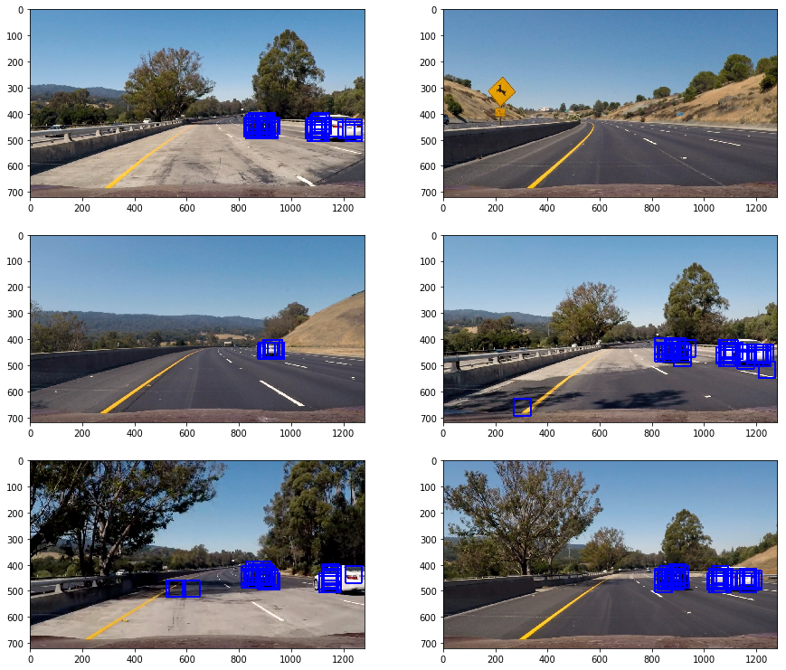
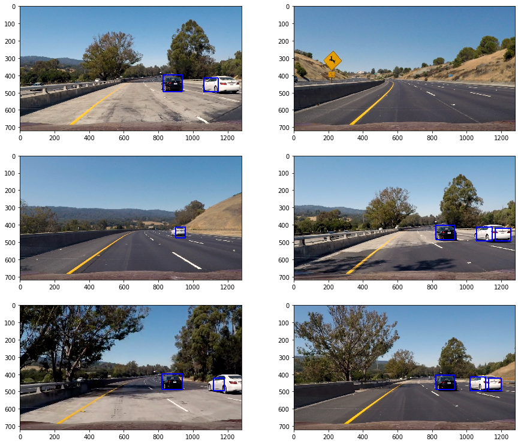
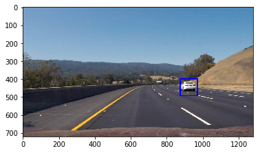
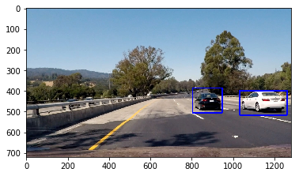
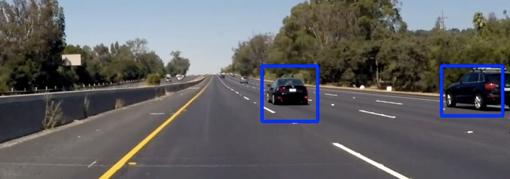

# Project #5 - Vehicle Detection Project

The goals / steps of this project are the following:

* Perform a Histogram of Oriented Gradients (HOG) feature extraction on a labeled training set of images and train a classifier Linear SVM classifier
* Optionally, you can also apply a color transform and append binned color features, as well as histograms of color, to your HOG feature vector. 
* Note: for those first two steps don't forget to normalize your features and randomize a selection for training and testing.
* Implement a sliding-window technique and use your trained classifier to search for vehicles in images.
* Run your pipeline on a video stream (start with the test_video.mp4 and later implement on full project_video.mp4) and create a heat map of recurring detections frame by frame to reject outliers and follow detected vehicles.
* Estimate a bounding box for vehicles detected.

## [Rubric](https://review.udacity.com/#!/rubrics/513/view) Points
### Here I will consider the rubric points individually and describe how I addressed each point in my implementation.  

---
### Writeup / README

#### 1. Provide a Writeup / README that includes all the rubric points and how you addressed each one.  You can submit your writeup as markdown or pdf.  [Here](https://github.com/udacity/CarND-Vehicle-Detection/blob/master/writeup_template.md) is a template writeup for this project you can use as a guide and a starting point.  

You're reading it!

### Histogram of Oriented Gradients (HOG)

#### 1. Explain how (and identify where in your code) you extracted HOG features from the training images.

First, we load the images for car and non-car classes. 
Overall, the count of the images is:
- Vehicle images count: 8792
- Non-vehicle image count: 8968

I started by reading in all the `vehicle` and `non-vehicle` images.  
Here is an example of one of each of the `vehicle` and `non-vehicle` classes:

#### 2. Explain how you settled on your final choice of HOG parameters.

I then explored different color spaces and different 
`skimage.hog()` parameters (`orientations`, `pixels_per_cell`, and `cells_per_block`).  
I grabbed random images from each of the two classes and displayed them to get a 
feel for what the `skimage.hog()` output looks like.

Here is an example using the `YCrCb` color space and HOG parameters 
of `orientations=8`, `pixels_per_cell=(8, 8)` and `cells_per_block=(2, 2)`:

this is hog for car

this is hog for landscape

The code for the HOG calculations provided from Udacity is in `lesson_functions.py`.
I'm using the `vis=True` argument to reduce the number of hog dimentions so we can
draw them. But the result which is later added to the feature vector
for training is has more information in it. This is an avergae of that result. 

I manually changed the parameters and the best result was with
YCrCb color space, Orientation of "8", 8 pixels/cell, 2 cells/block and all the hod
channels were put into the feature vector (maximum information, which was 
very much expected because svm can deal with it).

#### 3. Describe how (and identify where in your code) you trained a classifier using your selected HOG features (and color features if you used them).

I trained a linear SVM using the HOG features, Spatial features and Color historgram.
All those features are only numbers (floats) which were combined to 
make the final feature vector. We converted all the images of cars to their feature vector
and used it to train the SVC. 

Accuracy is **99%**

### Sliding Window Search

#### 1. Describe how (and identify where in your code) you implemented a sliding window search.  How did you decide what scales to search and how much to overlap windows?
First, I extracted all windows using the `slide_window` function provided by Udacity - which is
a very simple function taking an images, y start and stop values and 
returns all the images parts in certain steps with overlap of certain size. 
It assums we want to pick up the entire horizontal space and part of the 
vertical space. We use vertical space of `y_start_stop=[360, 700]` which
is the bottom half of the picture (assuming there is no car in the sky).
Every "window" in the image is predicted with our classifier to 
pick up only the "car" windows and draw them:

Than, we use the heat map to cancel the false positives and to unite the decision
of "car" frames (due to our window overlaps which create redundant predictions of 
cars). 

#### 2. Show some examples of test images to demonstrate how your pipeline is working.  What did you do to optimize the performance of your classifier?

Ultimately I searched on two scales using YCrCb 3-channel 
HOG features plus spatially binned color and histograms of 
color in the feature vector, which provided a nice result.  

Here are some example images:

---

### Video Implementation

#### 1. Provide a link to your final video output.  Your pipeline should perform reasonably well on the entire project video (somewhat wobbly or unstable bounding boxes are ok as long as you are identifying the vehicles most of the time with minimal false positives.)
Here's a [link to my video result](./project_video_processed.mp4)

#### 2. Describe how (and identify where in your code) you implemented some kind of filter for false positives and some method for combining overlapping bounding boxes.

I recorded the positions of positive detections in each frame of the video.  
From the positive detections I created a heatmap and then thresholded that 
map to identify vehicle positions.  
I then used `scipy.ndimage.measurements.label()` to identify individual blobs 
in the heatmap.  I then assumed each blob corresponded to a vehicle.  
I constructed bounding boxes to cover the area of each blob detected.  

Here's an example result showing the heatmap from a series of frames of video, 
the result of `scipy.ndimage.measurements.label()` and the bounding boxes 
then overlaid on the last frame of video:

---

### Discussion

#### 1. Briefly discuss any problems / issues you faced in your implementation of this project.  Where will your pipeline likely fail?  What could you do to make it more robust?

The choice of SVC here is great, providing accuracy of 99% 
but the false positive lowers the recall and we might pick up
imaginary cars from time to time. 
Also, the algorithm might get confused from "pictures" of cars
in big boards on the side of the road and make wrong decisions. 
I would also implement "side boards" detection to prevent printed 
images of cars etc to confuse the algorithm. 