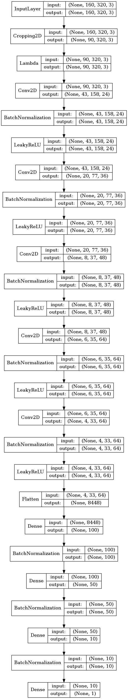

# Code and solutions for ND013
## Self driving car nanodegree

# Project #1 - Finding Lane Lines of the road

When we drive, we use our eyes to decide where to go.  The lines on the road that show us where the lanes are act as our constant reference for where to steer the vehicle.  Naturally, one of the first things we would like to do in developing a self-driving car is to automatically detect lane lines using an algorithm.

My pipeline consisted of  those steps:
> - convert to grayscale
> - blur filter
> - canny edge filter
> - mask for the region of interest
> - detect and draw the lane lines with Hough transform
> - Merge the Lane lines image with the original one

The first 3 steps **grayscale+blur+canny**  are to identify the dominant objects outlines (the blur effect takes care to eliminate "noise" which is picture details in our case). 

We mask the **region of interest** to the half bottom of the image. This is an issue for a production pipeline because we assume heavily on the position and angle of our Point-of-view in relation to the car.  

In order to draw a **single line on the left and right lanes**, I modified the `draw_lines()` function:
> - Split all the lines by its X-values (before the middle of the screen - to the left and visa versa). 
> - Remove lines that are too horizontal (less than 30 degrees). 
> - Estimate the linear coefficients of each side with my `calc_line_fit` function. We use a weight-array to increase the effect of **long lines** we detect in the hough transform. The longer the line - the better the computer can "see" it - and this is why it should influence our decision more. 
> - Low-pass-filtering the coefficients results with a previous lanes state we keep globally in order to prevent rapid changes by the different "edge cases" we may encounter during our ride - this keeps a slow transition of the car along the lanes and makes the pipeline more robust. 
>  - for example: our previous left lane was (a0,b0) = (-50, 30) our LPF coefficient is a=0.95 and we just calculated the left lane is (a1,b1)=(-40, 20) so our new lane is going to be: (a,b) = a*(a0,b0) + (1-a)*(a1,b1) = 0.95*(-50,30) + 0.05*(-40,20) = (-49.5, 29.5).
> - With the linear coefficients we can **draw two lines** (left and right). 

# Project #2 - Traffic Sign Recognition

Build a Traffic Sign Recognition model

## Goals/Steps
* Load the data set (see below for links to the project data set)
* Explore, summarize and visualize the data set
* Design, train and test a model architecture
* Use the model to make predictions on new images
* Analyze the softmax probabilities of the new images
* Summarize the results with a written report

## Dataset
The dataset is a bunch of images from 43 different classes of traffic signs in germany.

The bar chart shows the data distribution of the training data. Each bar represents one class of the dataset.

## Results
I used Lenet neuronal network to classify the traffic signs. 
 The input of the network is an image and the output is 
 the probabilty of each of the possible traffic signs.
 
 My final model consisted of the following layers:

| Layer         		|     Description	        					|
|:---------------------:|:---------------------------------------------:|
| Input         		| 32x32x1 grayscale image   							|
| Convolution 5x5     	| 2x2 stride, valid padding, outputs 28x28x6 	|
| RELU					|												|
| Max pooling	      	| 2x2 stride,  outputs 14x14x6 				|
| Convolution 5x5	    | 2x2 stride, valid padding, outputs 10x10x16    |
| RELU					|												|
| Max pooling	      	| 2x2 stride,  outputs 5x5x16 				|
| Flatten				| 3 dimensions -> 1 dimension					|
| Fully connected		| input 412, output 122        									|
| RELU					|												|
| Dropout				| 50% keep        									|
| Fully connected		| input 122, output 84        									|
| RELU					|												|
| Dropout				| 50% keep        									|
| Fully connected		| input 84, output 43        									|

Here are my final training parameters:
- EPOCHS = 20
- BATCH_SIZE = 32
- LEARNING RATE = 0.0005)

My results after training the model:
* Validation Accuracy = **96%**
* Test Accuracy = **93.7%**

# Project #3 - Behavioral Cloning 

The goals / steps of this project are the following:
* Use the simulator to collect data of good driving behavior
* Build, a convolution neural network in Keras that predicts steering angles from images
* Train and validate the model with a training and validation set
* Test that the model successfully drives around track one without leaving the road
* Summarize the results with a written report

I used nvidia autonomous car network that attempted to train a similiar network
with the same goals - steering the car through a road. 

I used different hyperparameters, and I needed to output only one target - the steering angle
of the car. You can see the visualization later in the writeup. 

# Project #4 - Advanced Lane Finding Project

The goals / steps of this project are the following:

* Compute the camera calibration matrix and distortion coefficients given a set of chessboard images.
* Apply a distortion correction to raw images.
* Use color transforms, gradients, etc., to create a thresholded binary image.
* Apply a perspective transform to rectify binary image ("birds-eye view").
* Detect lane pixels and fit to find the lane boundary.
* Determine the curvature of the lane and vehicle position with respect to center.
* Warp the detected lane boundaries back onto the original image.
* Output visual display of the lane boundaries and numerical estimation of lane curvature and vehicle position.

In this project I created a computer vision pipeline 0 it receives as an input an image (numpy) and returns the processed images after the following steps:
1. undistort (with calibration chessboard correction)
2. thresholding
3. perspective trainsition (bird-view)
4. cut only the region of interest
5. detect the lines with window-fit approach
6. calculate the polynomical coefficients that represents the lines of the road
7. draw a new numpy matrix that represents the result frame and return it

the final result looks like this:

